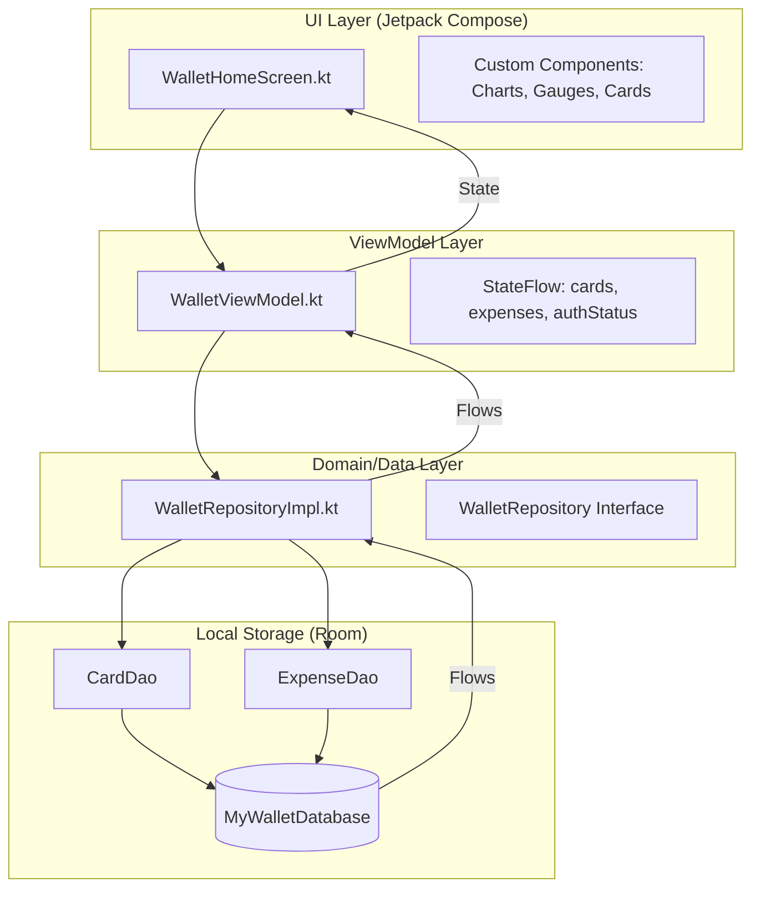
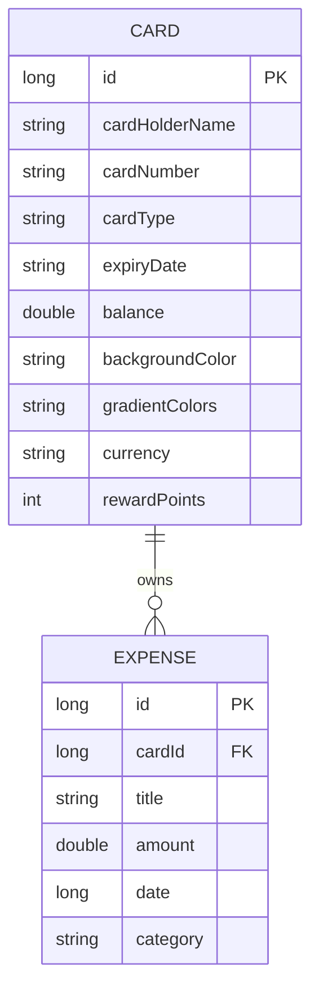
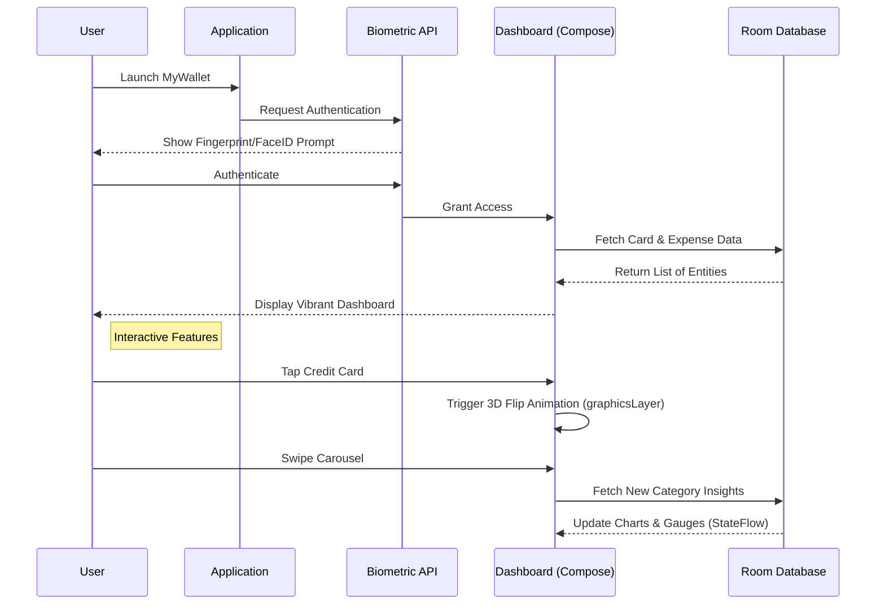

# 💳 MyWallet - The Ultimate MAD Showcase

**MyWallet** is a high-end, "super extreme" credit card wallet and financial management application built to demonstrate mastery over **Modern Android Development (MAD)**. This project serves as a comprehensive educational journey into the world of Kotlin, Jetpack Compose, and advanced system architecture.

---

## 🌟 The "Human" Story Behind MyWallet
Every line of code in this project was written with a specific purpose: **to bridge the gap between technical complexity and human usability.** 

As a developer gaining experience in the Android ecosystem, I wanted to build more than just a functional app. I wanted to build an experience that feels *alive*. 
*   **Empathy in Design**: The app doesn't just show numbers; it greets you based on the time of day and offers encouraging insights about your savings habits.
*   **Tactile Feedback**: The 3D card flips and animated gauges were implemented to satisfy the human desire for physical-like interaction in a digital world.
*   **Global Inclusivity**: By supporting multiple currencies and international merchants, the app acknowledges the diverse, interconnected world we live in.

---

## 🎨 Visual Gallery

  
  
  

  
  
  

  
  
  

  
  
  

  
  
  

  
  
  

  
  
  

  
  
  

  
  
  

---

## 🛠 Technical Stack (The MAD Score)

The project leverages the best-in-class libraries and patterns provided by the Android ecosystem:

- **Language:** 100% [Kotlin](https://kotlinlang.org/)
    *   *Coroutines & Flow*: For reactive, asynchronous data streams that keep the UI buttery smooth.
    *   *Kotlin Symbol Processing (KSP)*: For lightning-fast code generation in Room and Hilt.
- **UI:** [Jetpack Compose](https://developer.android.com/jetpack/compose)
    *   *Custom Canvas Drawing*: Low-level graphics for charts and gauges, avoiding heavy external dependencies.
    *   *GraphicsLayer*: For advanced 3D transformations that make the digital cards feel physical.
- **Architecture:** [MVVM](https://developer.android.com/topic/architecture) (Model-View-ViewModel)
    *   *Repository Pattern*: Abstracting data sources for a clean, testable domain layer.
- **Dependency Injection:** [Hilt](https://dagger.dev/hilt/)
    *   Scoped modules for Database, DAO, and Repository provisioning, ensuring high maintainability.
- **Database:** [Room](https://developer.android.com/training/data-storage/room)
    *   Versioned schema (v4) with automated migration handling and relational data integrity.
- **Security:** [Biometric API](https://developer.android.com/training/sign-in/biometric-auth)
    *   Enterprise-grade Fingerprint and FaceID integration for a secure, modern entry flow.

---

## 🏗 System Architecture

### 📊 MVVM Data Flow
The following diagram illustrates the unidirectional data flow and the clear separation of concerns that ensures the app remains scalable and bug-free:

### 🗄 Database Schema (ER Diagram)
The relational structure ensures that every transaction is perfectly linked to its parent card, maintaining a perfect financial audit trail:

---

## 🔄 User Flow Logic

How the user interacts with the MyWallet ecosystem:

---

## ✨ Key Features "Under the Hood"

### 1. **High-Performance Data Visualization**
Built with the custom **Canvas API**, avoiding heavy external libraries for maximum speed:
*   **Animated Line Charts**: Uses `Path` and `drawPath` with animated progress offsets to render spending trends.
*   **Segmented Pie Charts**: Uses `drawArc` with dynamic sweep angles and color mapping for category analysis.
*   **Circular Progress Gauges**: Custom sweep gradients combined with `Stroke` drawing for budget tracking.

### 2. **3D Interactive Elements**
Using the `graphicsLayer` API, cards feature a realistic 180-degree **Y-axis rotation**. The UI conditionally swaps between the front and back face at the 90-degree midpoint to maintain the illusion of a single physical object.

### 3. **Smart Security Hub**
A centralized security banner confirms that **Biometric Protection** is active. The app handles various hardware states (No hardware, No enrollment, Success, Error) to ensure a smooth demo experience regardless of the device.

### 4. **Multi-Currency Engine**
The app features a unified currency handling system. Swiping a card instantly updates the local state, re-formatting all balances and transactions into **USD**, **EUR**, or **GBP** using the appropriate symbols and locales.

---

## 🎓 Educational Milestones
Through this project, I have mastered:
- [x] **Reactive Programming**: Full utilization of `Flow` and `StateFlow` for real-time UI updates.
- [x] **Advanced Animations**: Mastering `animate*AsState`, `Animatable`, and `InfiniteTransition`.
- [x] **Clean Architecture**: Implementing strict MVVM with a robust Repository layer.
- [x] **Custom Drawing**: Building complex visualizations from scratch using `Canvas`.
- [x] **Dependency Injection**: Streamlining app-wide singleton and viewmodel provisioning with Hilt.

---

## 🗺 Future Roadmap (Scalability)
While this is an educational demo, it is built to scale:
- [ ] **Cloud Sync**: Integration with Retrofit and a real backend (Node.js/Firebase).
- [ ] **AI Spending Predictor**: Using TensorFlow Lite to predict future expenses based on history.
- [ ] **Shared Wallets**: Multi-user support for family budget management.
- [ ] **Widget Support**: Home screen widgets for quick balance checks.

---

## 👨‍💻 How to Run
1. Clone the repository.
2. Open in **Android Studio (Latest Release)**.
3. Sync Gradle and ensure **JDK 17+** is configured.
4. Run on a physical device or emulator with Biometric support.

---
